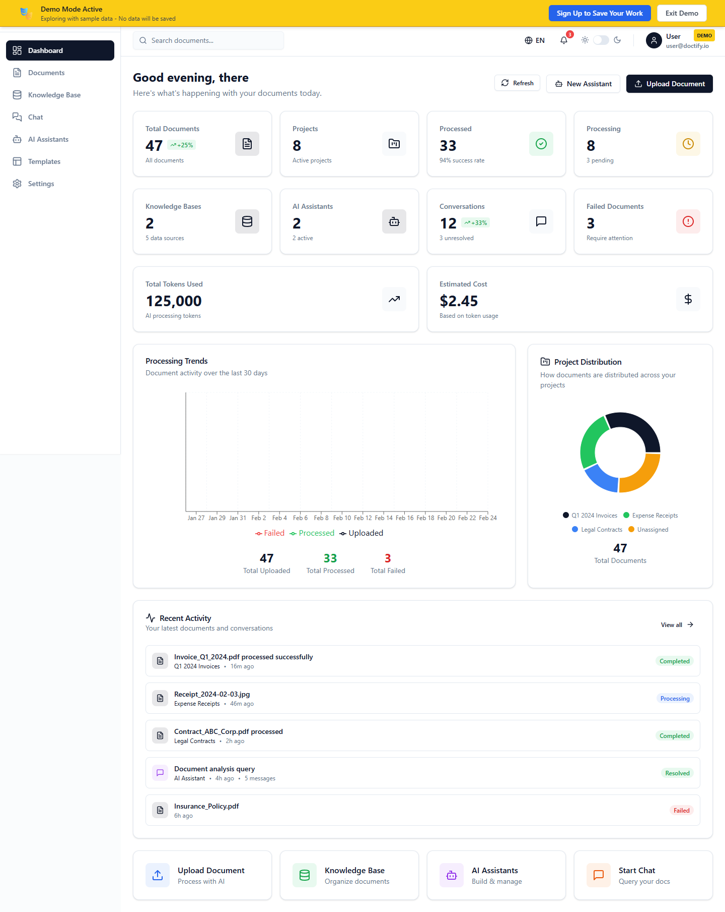
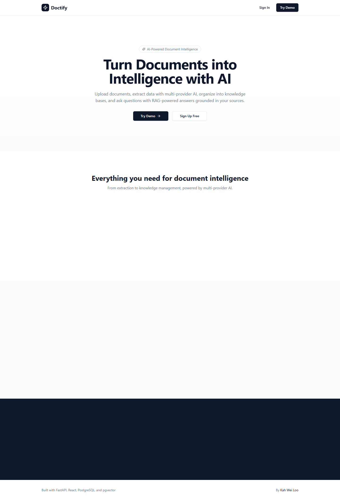
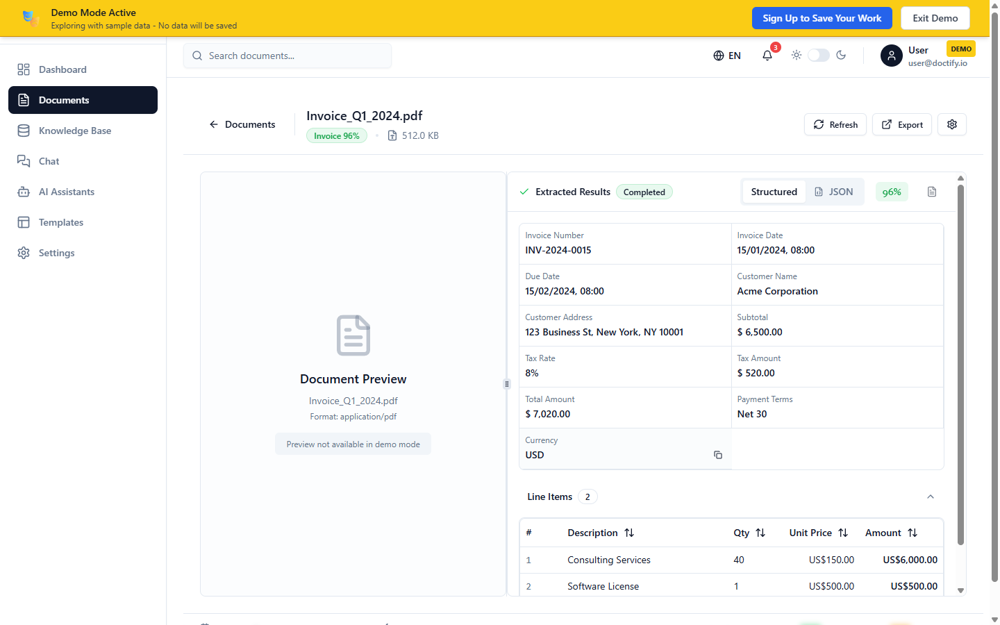
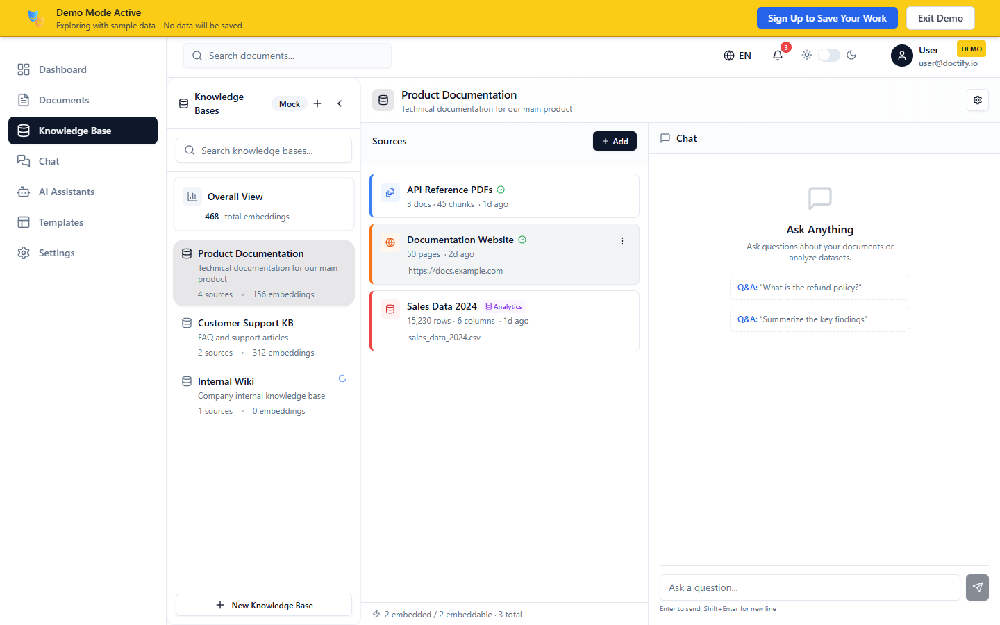
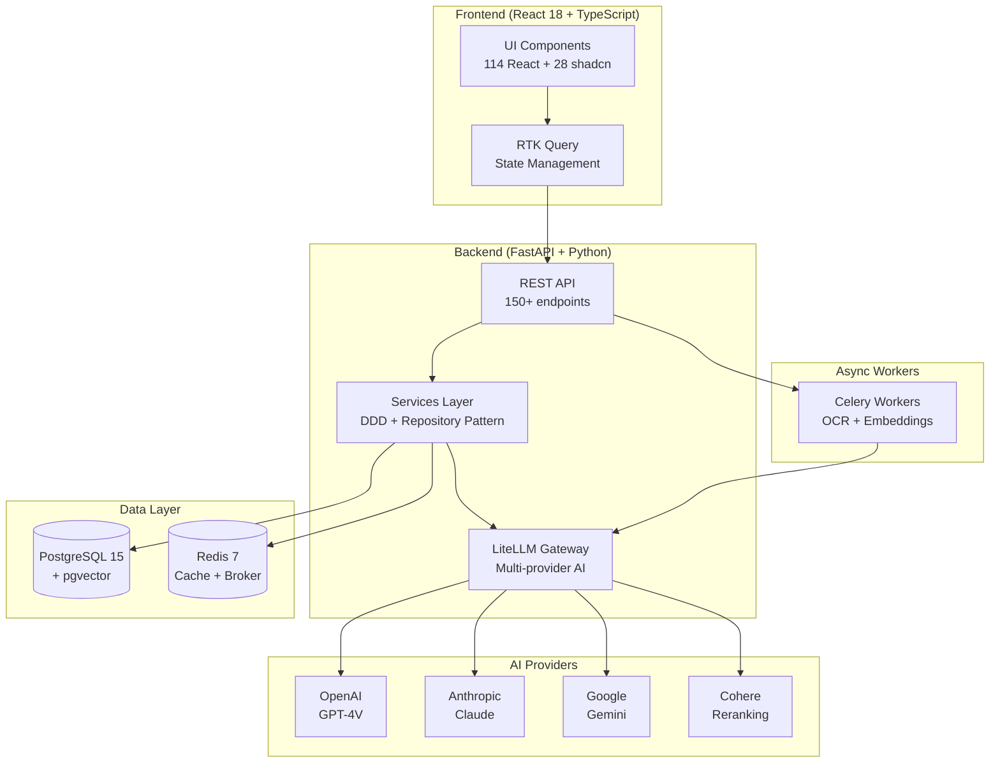

<div align="center">

# Doctify

### AI-Powered Document Intelligence Platform

Turn documents into structured data and searchable knowledge with multi-provider AI.

[](https://www.python.org/)
[](https://react.dev/)
[](https://fastapi.tiangolo.com/)
[](https://www.postgresql.org/)
[](./LICENSE)

</div>

---



## What is Doctify?

Doctify is a full-stack SaaS platform that processes business documents through a multi-AI pipeline and organizes the results into queryable knowledge bases.

1. **Upload** — PDF, PNG, JPG, TIFF documents via drag-and-drop
2. **Extract** — Multi-provider OCR with GPT-4V → Claude → Gemini automatic fallback
3. **Organize** — Build knowledge bases with vector embeddings and semantic search
4. **Ask** — RAG-powered Q&A with source citations and groundedness verification

> **Live Demo**: [doctify.itskw.dev](https://doctify.itskw.dev) — or clone and run locally with Docker (see [Quick Start](#quick-start)). Use the **Try Demo** button to explore with sample data — no API keys needed.

## Key Features

| Feature | Description | Tech |
|---------|-------------|------|
| AI-Powered OCR | Multi-provider extraction with automatic fallback chain | GPT-4V, Claude, Gemini via LiteLLM |
| Knowledge Bases | Organize documents into searchable vector collections | pgvector + Cohere reranking |
| RAG Q&A | Ask questions grounded in your documents with citations | 4-layer pipeline: retrieve → rerank → generate → verify |
| AI Assistants | Custom assistants with system prompts, KB binding, widget embed | Configurable per-assistant model + prompt |
| Real-time Processing | Live progress updates via WebSocket | Celery + Redis + WebSocket |
| AI Model Management | Admin UI for model catalog, purpose assignment, gateway config | LiteLLM gateway + DB-backed settings |
| Dashboard Analytics | Document stats, processing trends, cost tracking | Recharts + unified stats API |
| Security | JWT with jti blacklist, bcrypt, Redis rate limiting, account lockout | HSTS, CSP, security headers |

<details>
<summary><strong>Screenshots</strong></summary>

| Feature | Screenshot |
|---------|------------|
| Landing Page |  |
| OCR Results |  |
| Knowledge Base |  |

</details>

## Architecture



**Backend**: FastAPI, SQLAlchemy 2.0 (async), Repository Pattern, DDD, Celery, LiteLLM gateway
**Frontend**: React 18, TypeScript, Vite, TailwindCSS, shadcn/ui, RTK Query, Recharts
**Infrastructure**: Docker Compose, PostgreSQL 15 + pgvector, Redis 7, GitHub Actions

## Quick Start

### Docker (recommended)

```bash
git clone https://github.com/kahwei-loo/doctify.git
cd doctify
cp backend/.env.example backend/.env    # Add your AI API keys
cp frontend/.env.example frontend/.env.local
docker-compose up -d
```

Open `http://localhost:3003` and click **Try Demo** to explore with sample data.

### Local Development

```bash
# Backend
cd backend
python -m venv venv && source venv/bin/activate
pip install -r requirements/dev.txt
uvicorn app.main:app --reload --port 8008

# Frontend (separate terminal)
cd frontend
npm install && npm run dev

# Celery worker (separate terminal)
cd backend
celery -A app.workers.celery_app worker -l info --pool=solo -Q ocr_queue
```

| Service | URL |
|---------|-----|
| Frontend | http://localhost:3003 |
| Backend API | http://localhost:8008 |
| API Docs (Swagger) | http://localhost:8008/docs |

## Documentation

- [Architecture Design](./docs/architecture/) — System architecture and design decisions
- [Deployment Guide](./docs/deployment/) — Production deployment with Docker
- [RAG Documentation](./docs/rag/) — AI Q&A system guide and tuning

## Author

**Kah Wei Loo** — [GitHub](https://github.com/kahwei-loo) · [LinkedIn](https://linkedin.com/in/kahwei-loo) · [Portfolio](https://kahweiloo.com)

## License

[MIT](./LICENSE)
