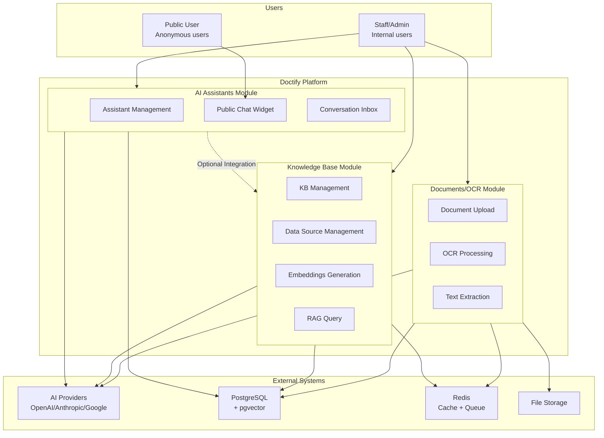
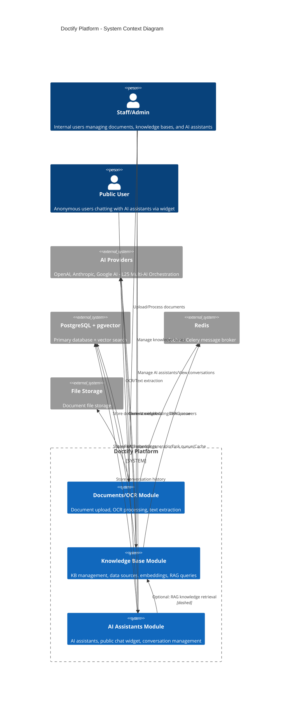

# System Context Diagram

## Overview
Shows the overall architecture of the Doctify platform and its interactions with external systems.

## Mermaid Diagram

## C4 Model Version

## Key Points

1. **Three Independent Modules**: Documents/OCR, Knowledge Base, and AI Assistants operate independently
2. **Optional Integration**: AI Assistants can optionally connect to Knowledge Base for RAG-enhanced responses
3. **Shared Infrastructure**: All modules share AI Providers, PostgreSQL, and Redis
4. **User Roles**: Staff can access all modules; Public Users can only interact with AI Assistants via widget
