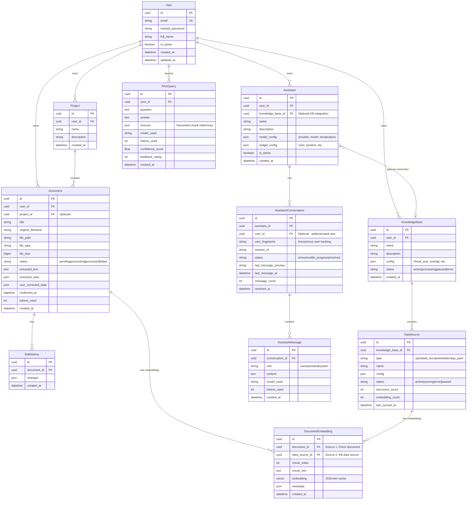
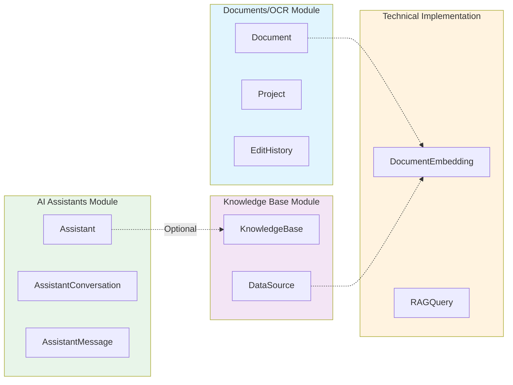

# Entity Relationship Diagram

## Overview
Shows all core database models and their relationships in Doctify, demonstrating the independence of the three core modules.

## Mermaid ER Diagram



## Module Independence Analysis



## Key Points

### Module Independence Proof

| Module | Direct FK to Other Core Modules | Conclusion |
|--------|--------------------------------|------------|
| Documents/OCR | None | Fully independent |
| Knowledge Base | None | Fully independent |
| AI Assistants | Optional `knowledge_base_id` | Independent but can integrate |

### DocumentEmbedding Dual Source

```
DocumentEmbedding
├── document_id (Source 1) ─── Generated directly from Document
└── data_source_id (Source 2) ─── Generated from Knowledge Base DataSource

Constraint: Exactly one source must be set (XOR)
```

### User Ownership

All three core modules are directly owned by User, not dependent on each other:
- User → Documents
- User → KnowledgeBase
- User → Assistant
