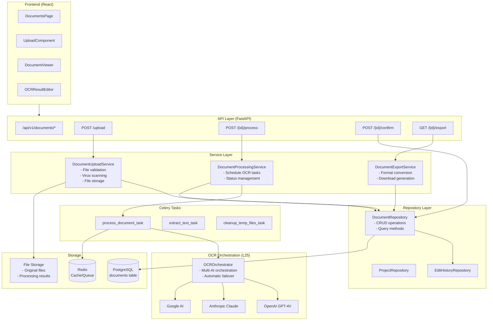
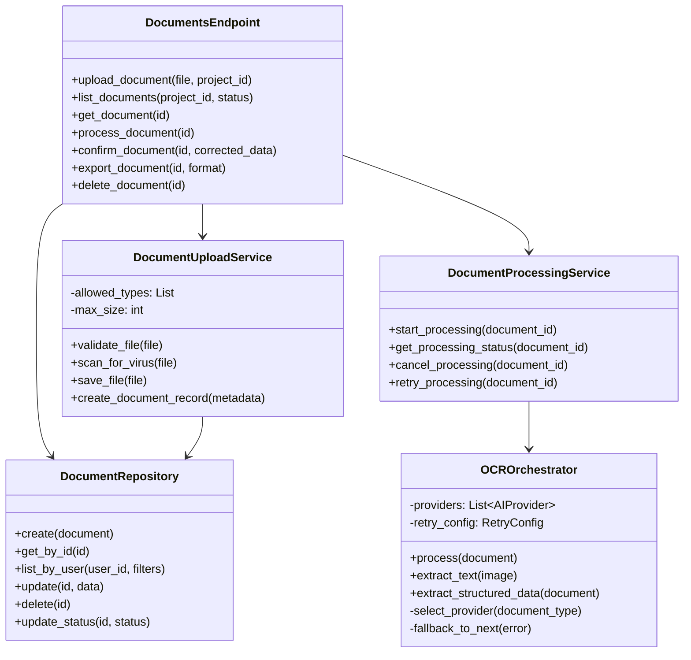

# Documents/OCR Module - Component Diagram

## Overview
Shows the internal architecture of the Documents/OCR module, including all service components, data flow, and dependencies.

## Component Architecture



## Class Diagram



## Data Flow Diagram


## File Structure

```
backend/app/
├── api/v1/endpoints/
│   └── documents.py          # API endpoints
├── services/
│   └── document/
│       ├── upload.py         # Upload service
│       ├── processing.py     # Processing service
│       └── export.py         # Export service
├── services/ocr/
│   ├── orchestrator.py       # L25 OCR orchestration
│   ├── providers/
│   │   ├── openai.py
│   │   ├── anthropic.py
│   │   └── google.py
│   └── extractors/
│       ├── text.py
│       └── structured.py
├── tasks/
│   └── document_tasks.py     # Celery tasks
└── db/repositories/
    └── document.py           # Data access layer

frontend/src/features/documents/
├── pages/
│   └── DocumentsPage.tsx
├── components/
│   ├── DocumentList.tsx
│   ├── DocumentUpload.tsx
│   ├── DocumentViewer.tsx
│   └── OCRResultEditor.tsx
├── hooks/
│   └── useDocuments.ts
└── services/
    └── documentsApi.ts       # RTK Query
```

## Key Technical Points

1. **L25 OCR Orchestration**: Multi-AI provider with automatic failover (OpenAI → Anthropic → Google)
2. **Async Processing**: Uses Celery for time-consuming OCR tasks
3. **User Confirmation Flow**: OCR results require user confirmation/correction before finalization
4. **File Security**: Virus scanning and file type validation on upload
