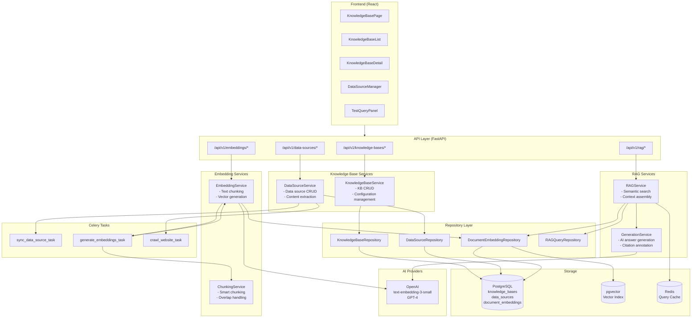
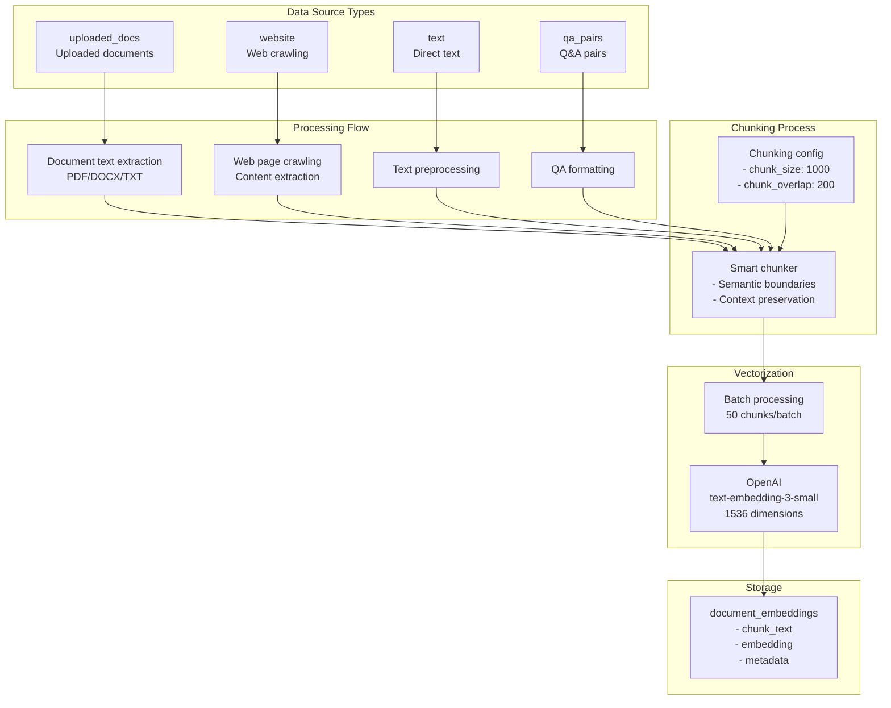
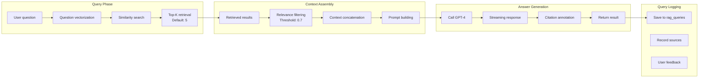
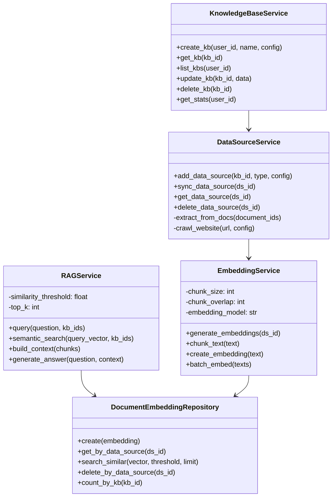

# Knowledge Base Module - Component Diagram

## Overview
Shows the internal architecture of the Knowledge Base module, including KB management, data source management, embeddings generation, and RAG query.

## Component Architecture



## Data Source Type Processing



## RAG Query Flow



## Class Diagram



## File Structure

```
backend/app/
├── api/v1/endpoints/
│   ├── knowledge_bases.py    # KB CRUD endpoints
│   ├── data_sources.py       # Data source endpoints
│   ├── embeddings.py         # Embedding endpoints
│   └── rag.py                # RAG query endpoints
├── services/
│   ├── knowledge_base/
│   │   ├── kb_service.py
│   │   └── data_source_service.py
│   ├── embedding/
│   │   ├── embedding_service.py
│   │   └── chunking_service.py
│   └── rag/
│       ├── rag_service.py
│       └── generation_service.py
├── tasks/
│   └── knowledge_base.py     # Celery tasks
└── db/repositories/
    ├── knowledge_base.py
    └── rag.py

frontend/src/features/knowledge-base/
├── pages/
│   └── KnowledgeBasePage.tsx
├── components/
│   ├── KnowledgeBaseList.tsx
│   ├── KnowledgeBaseDetail.tsx
│   ├── DataSourceManager.tsx
│   ├── DataSourceForm.tsx
│   └── TestQueryPanel.tsx
├── hooks/
│   └── useKnowledgeBase.ts
└── services/
    └── knowledgeBaseApi.ts   # RTK Query
```

## Key Technical Points

1. **Four Data Source Types**: uploaded_docs, website, text, qa_pairs
2. **Smart Chunking**: Configurable chunk_size and chunk_overlap
3. **pgvector**: PostgreSQL vector search extension with cosine similarity
4. **Batch Processing**: Embeddings generated in batches (50 chunks/batch) for efficiency
5. **RAG Relevance Filtering**: Default threshold 0.7 filters low-relevance results
