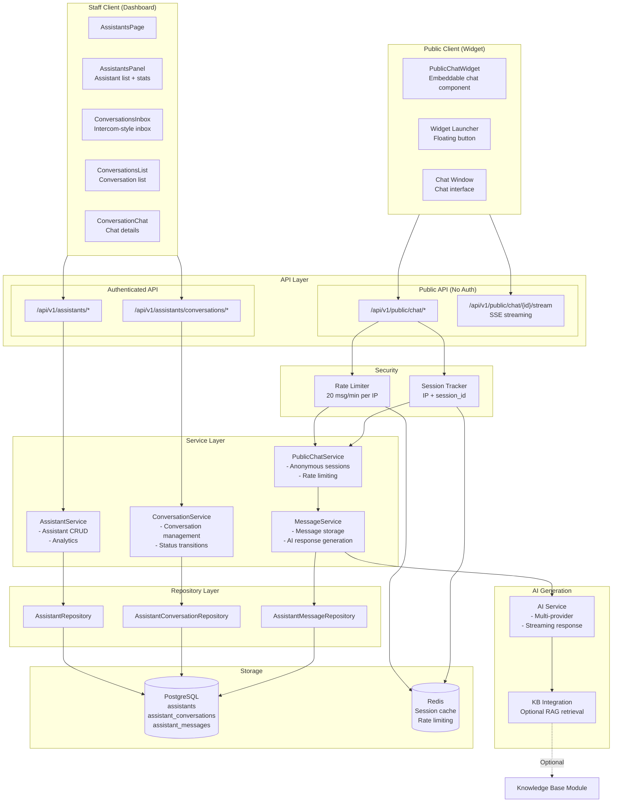
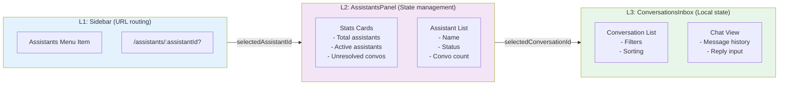
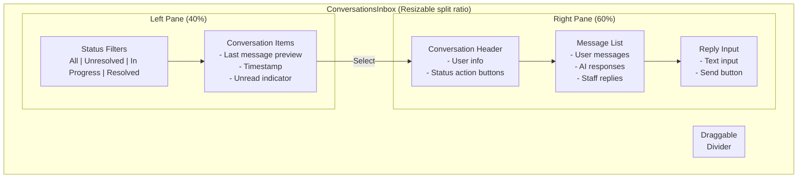
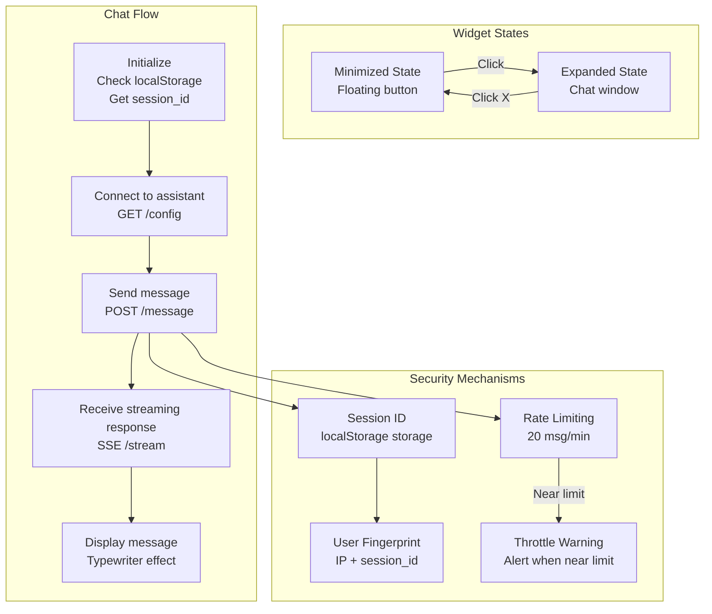
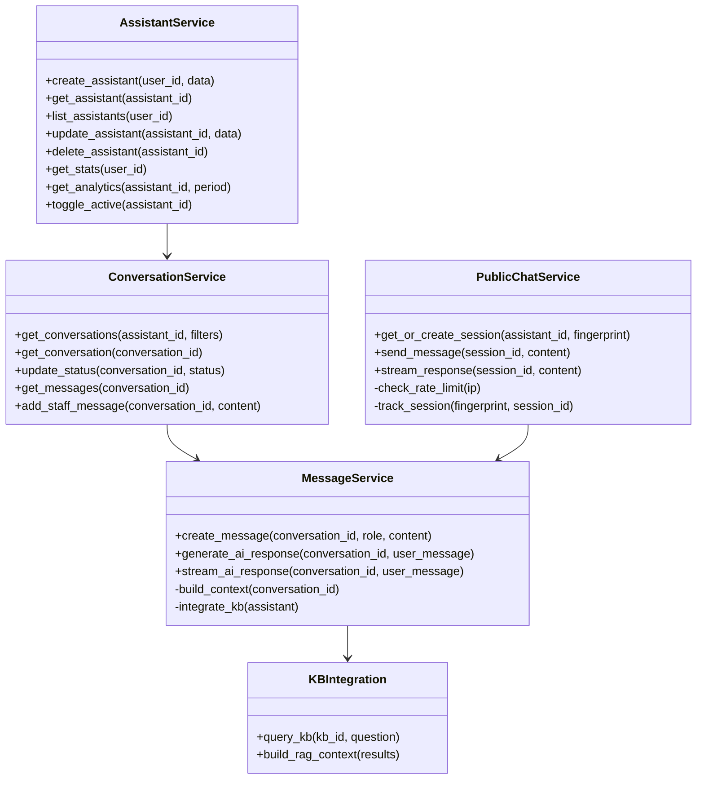
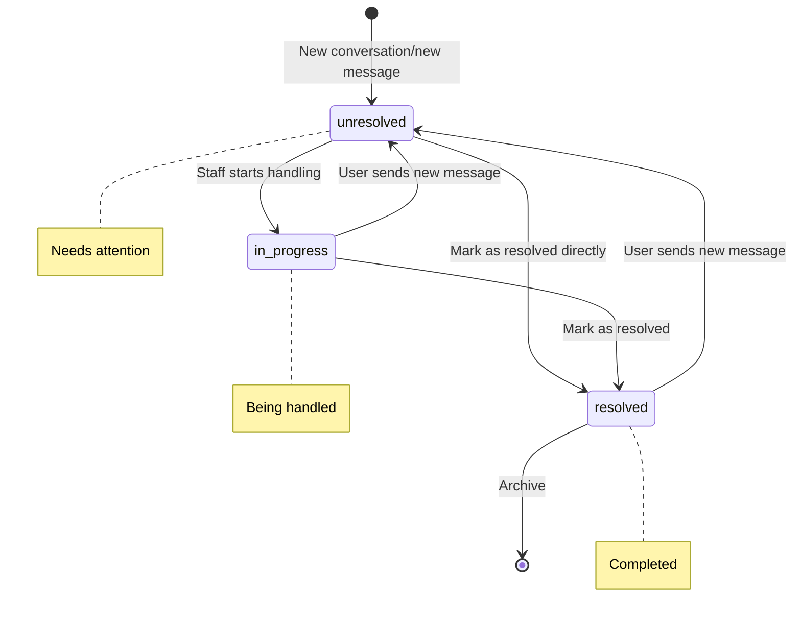

# AI Assistants Module - Component Diagram

## Overview
Shows the internal architecture of the AI Assistants module, including assistant management, public chat widget, and Intercom-style conversation inbox.

## Component Architecture



## Three-Level Navigation Architecture



## Intercom-Style Inbox Layout



## Public Chat Widget



## Class Diagram



## Conversation Status Transitions



## File Structure

```
backend/app/
├── api/v1/endpoints/
│   ├── assistants.py         # Assistant CRUD + conversation management
│   └── public_chat.py        # Public chat endpoints
├── services/
│   ├── assistant_service.py  # Assistant business logic
│   └── public_chat_service.py # Public chat service
├── db/
│   ├── models/
│   │   ├── assistant.py
│   │   └── assistant_conversation.py
│   └── repositories/
│       ├── assistant_repository.py
│       └── conversation_repository.py
└── middleware/
    └── rate_limit.py         # SlowAPI rate limiting

frontend/src/features/assistants/
├── pages/
│   └── AssistantsPage.tsx
├── components/
│   ├── AssistantsPanel.tsx       # L2: Assistant list
│   ├── ConversationsInbox.tsx    # L3: Inbox layout
│   ├── ConversationsList.tsx     # Conversation list
│   ├── ConversationChat.tsx      # Chat details
│   ├── AssistantFormModal.tsx    # Create/Edit form
│   ├── PublicChatWidget.tsx      # Public chat widget
│   └── EmptyStates.tsx           # Empty state components
├── hooks/
│   ├── useAssistantWebSocket.ts  # WebSocket communication
│   └── usePublicChatSession.ts   # Public session management
└── services/
    ├── assistantsApi.ts          # RTK Query
    └── conversationsApi.ts
```

## Key Technical Points

1. **Intercom-Style Inbox**: Resizable split-pane layout
2. **Three-Level Navigation**: L1 URL routing → L2 Assistant selection → L3 Conversation management
3. **SSE Streaming**: Public chat uses Server-Sent Events for typewriter effect
4. **Rate Limiting**: SlowAPI implementing 20 msg/min per IP
5. **Anonymous Tracking**: IP + session_id fingerprint for anonymous user identification
6. **Optional KB Integration**: Assistants can connect to Knowledge Base for RAG-enhanced responses
