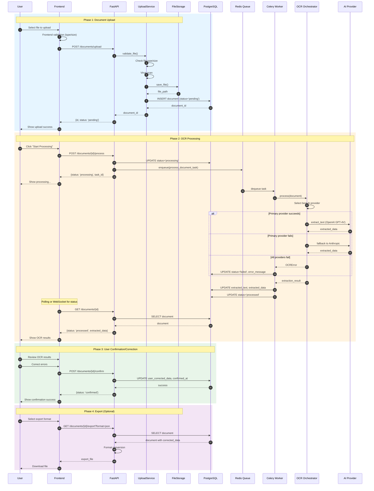
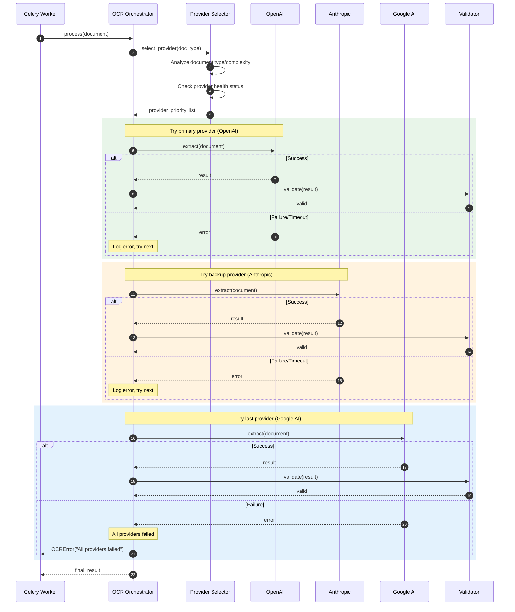
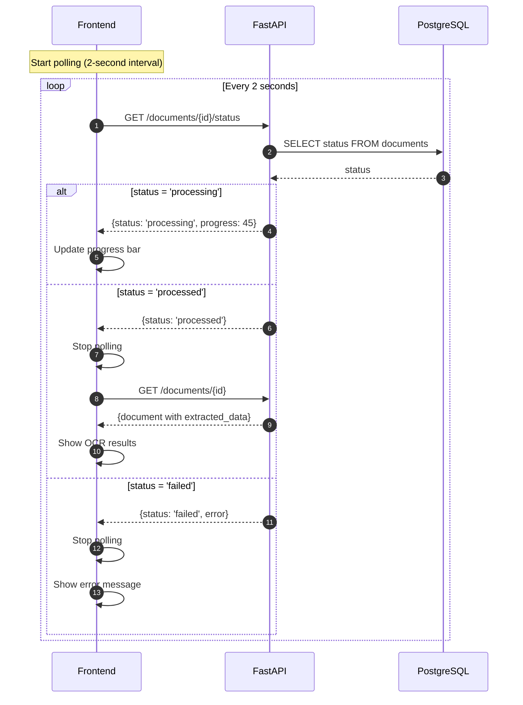
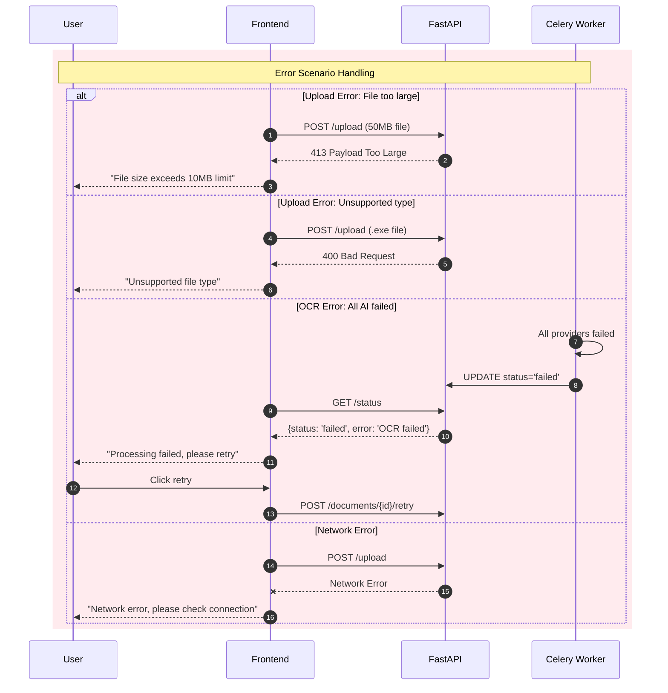

# Document OCR Sequence Diagram

## Overview
Shows the complete flow from document upload to OCR processing and user confirmation.

## Complete Flow Sequence Diagram

## L25 OCR Orchestration Detailed Flow

## Status Polling Flow

## Error Handling Flow

## Key Timing Metrics

| Phase | Expected Duration | Notes |
|-------|-------------------|-------|
| File upload | 1-5 seconds | Depends on file size and network |
| Task enqueue | <100ms | Redis queue operation |
| OCR processing | 5-30 seconds | Depends on document complexity |
| Result storage | <500ms | Database write |
| User confirmation | User action | Manual review and correction |
| Export generation | <1 second | Format conversion |
