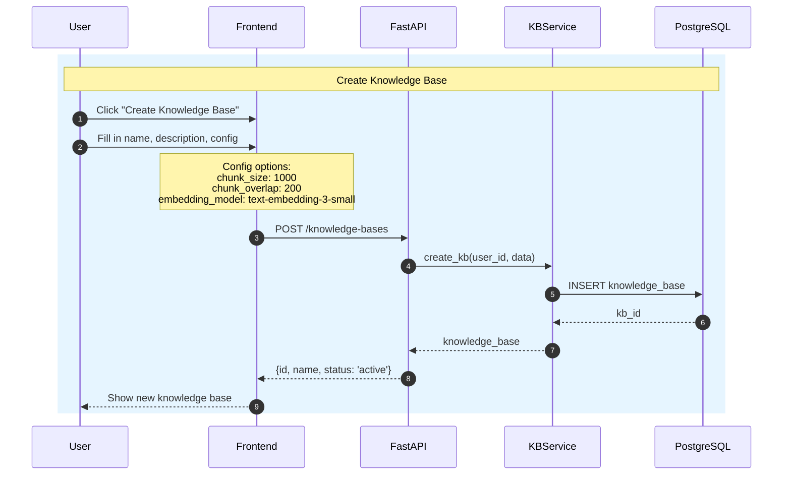
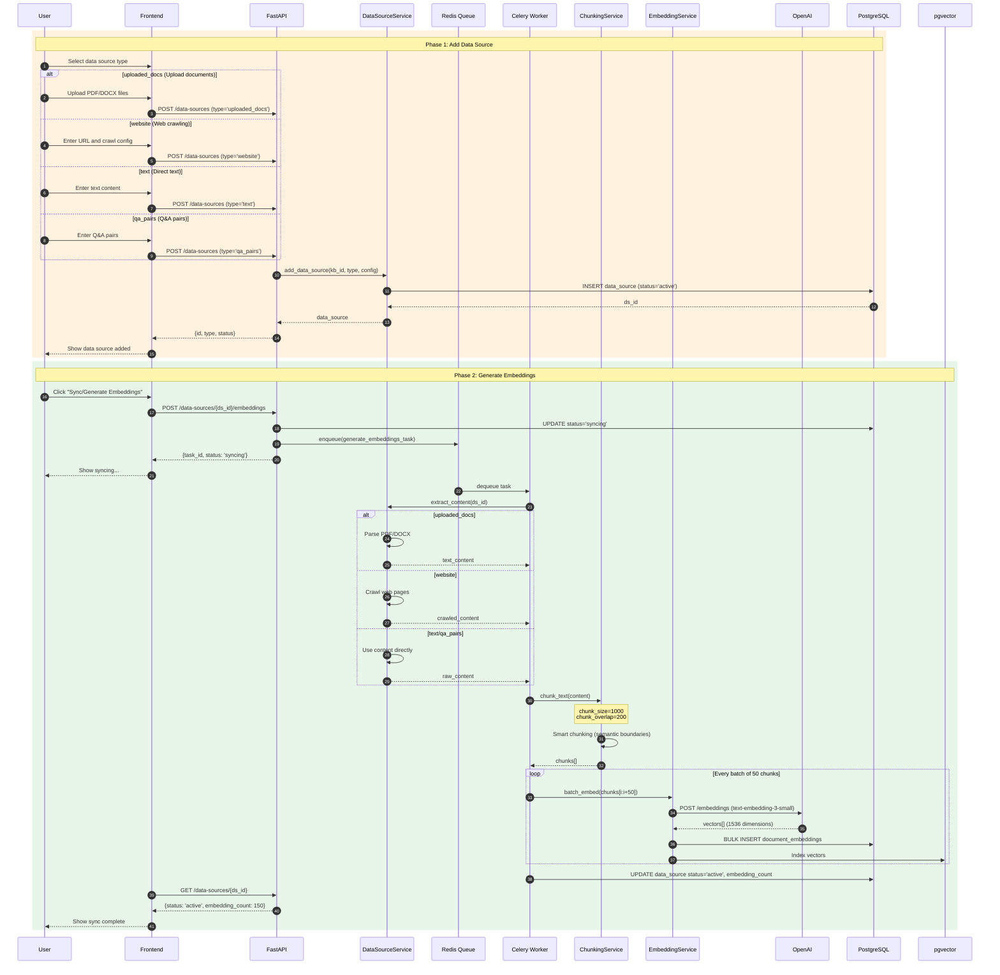
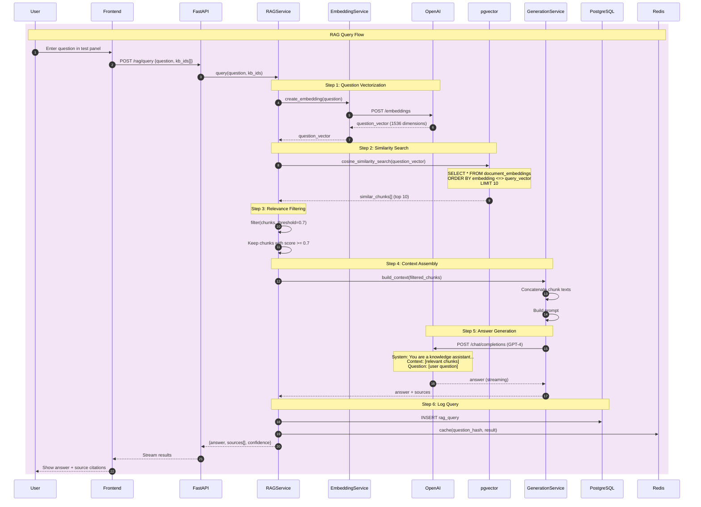
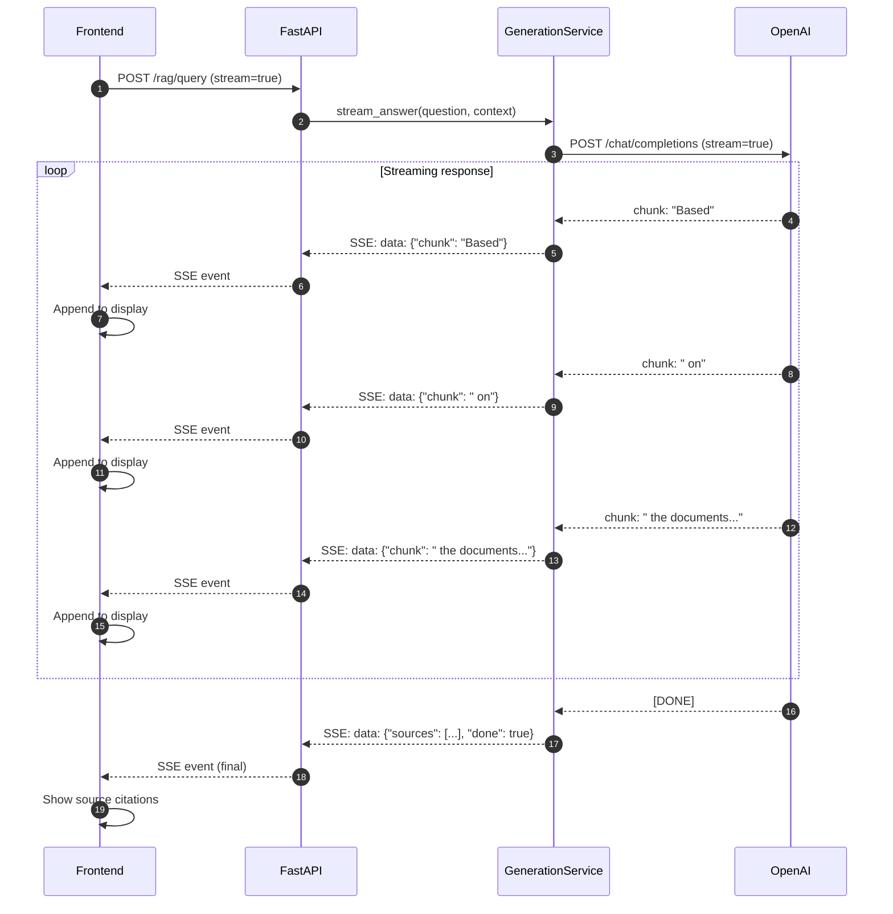
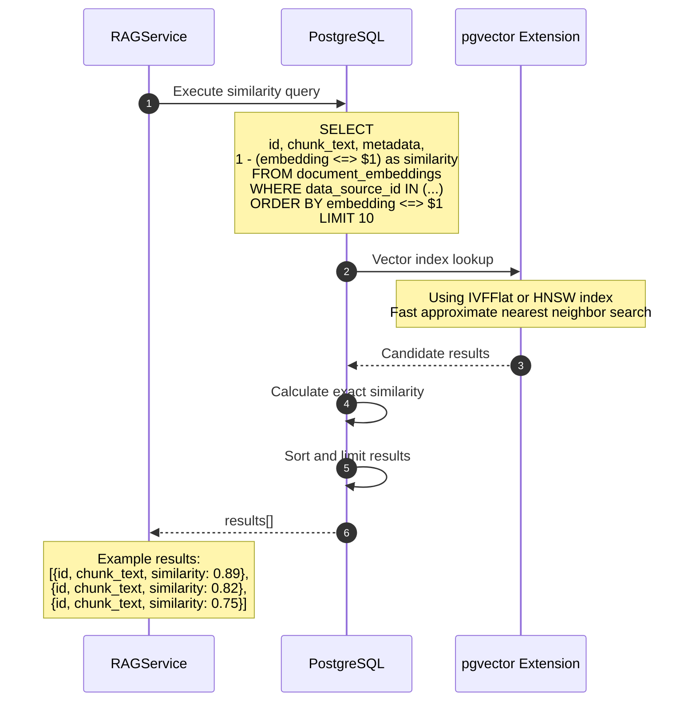
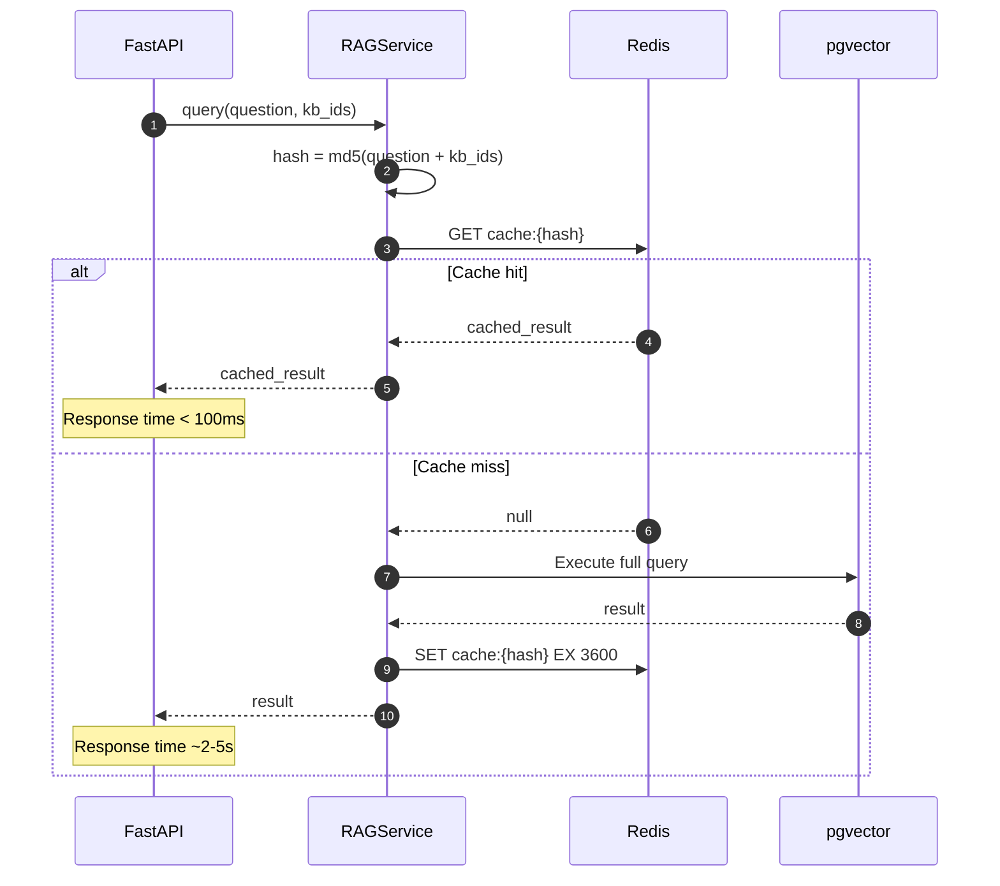

# Knowledge Base RAG Query Sequence Diagram

## Overview
Shows the complete lifecycle of a Knowledge Base from creation to RAG query.

## Knowledge Base Creation and Configuration

## Adding Data Sources and Generating Embeddings

## RAG Query Flow

## Streaming Response Detailed Flow

## Vector Search Details

## Caching Strategy

## Key Performance Metrics

| Operation | Expected Duration | Notes |
|-----------|-------------------|-------|
| Question vectorization | 100-200ms | OpenAI API call |
| Vector search | 10-50ms | pgvector index query |
| Context assembly | <10ms | In-memory operation |
| AI answer generation | 1-5s | GPT-4 streaming response |
| Cache read | <10ms | Redis GET |
| Total response time | 1.5-6s | Complete flow |
| Cache hit response | <100ms | Direct return |
