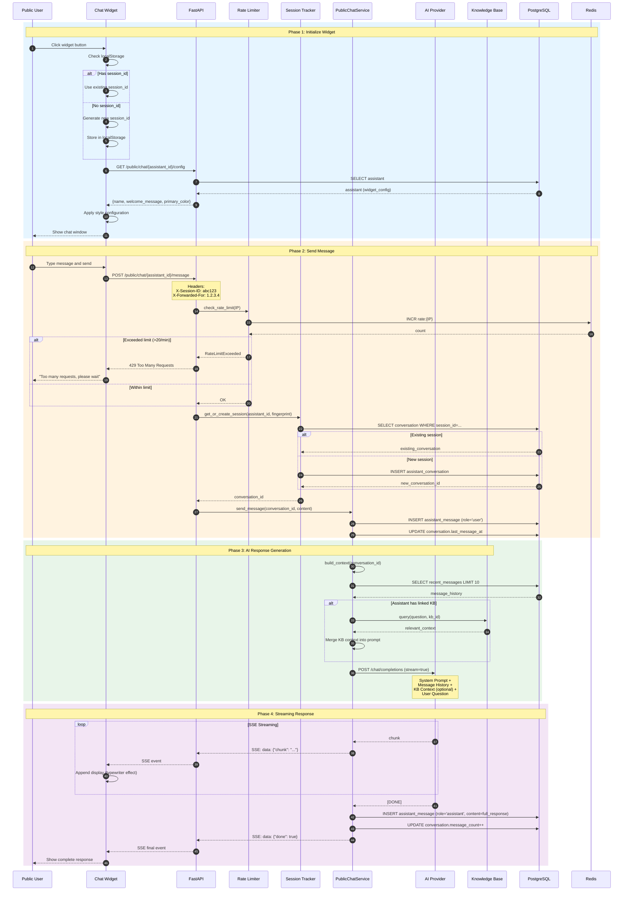
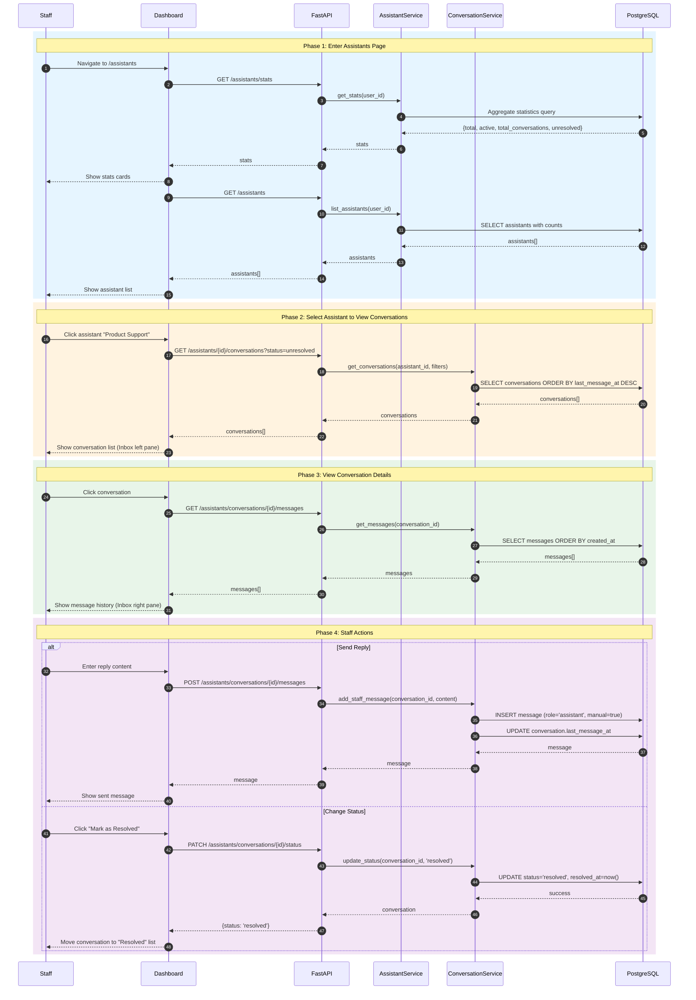
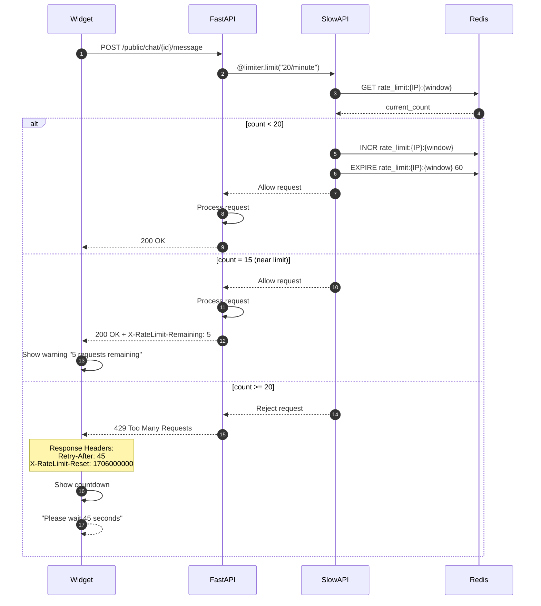
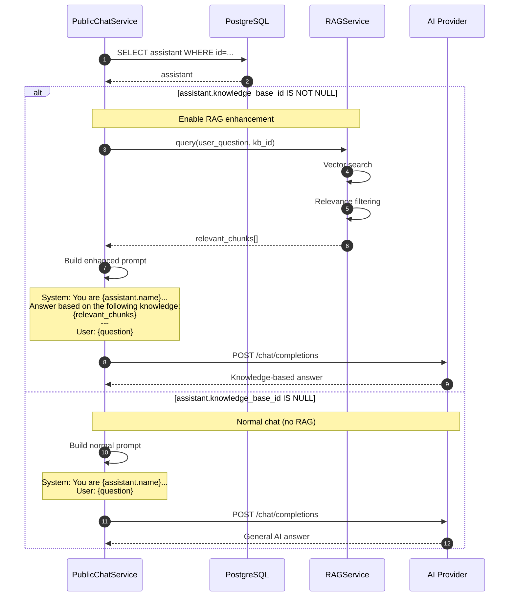
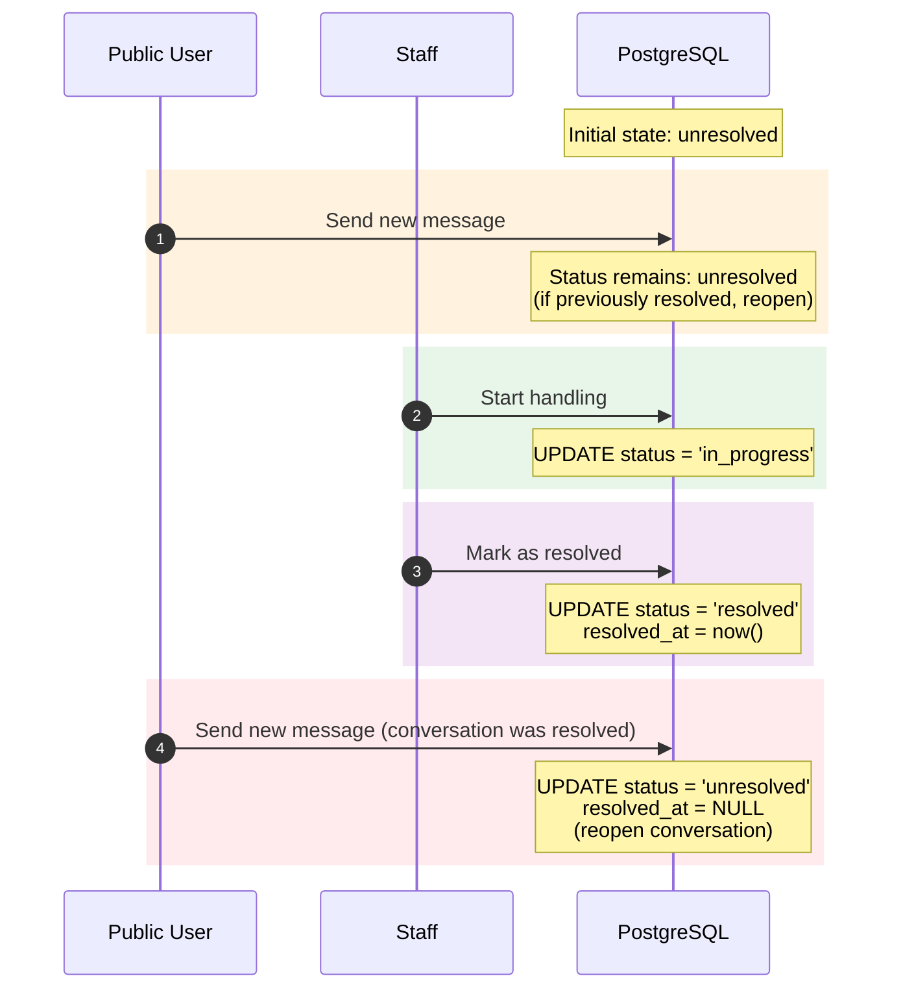
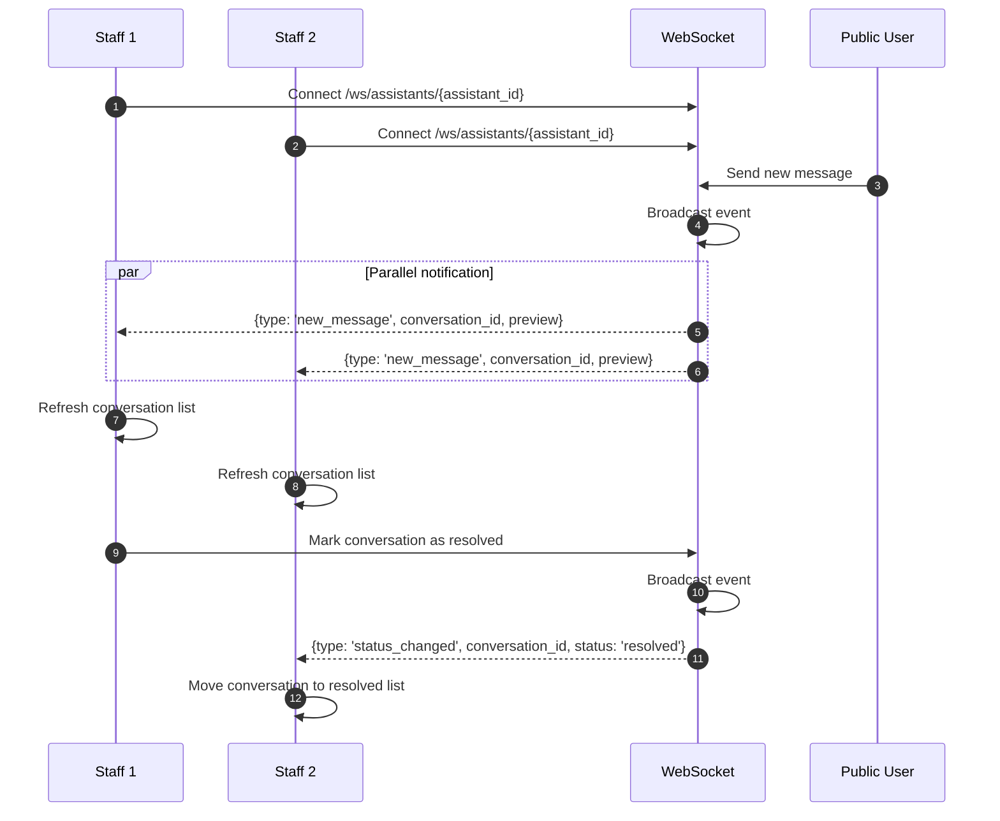

# AI Assistant Chat Sequence Diagram

## Overview
Shows the complete flow from public user initiating a conversation to staff management.

## Public User Initiates Conversation

## Staff Views and Manages Conversations

## Rate Limiting Detailed Flow

## Optional KB Integration Flow

## Conversation Status Transitions

## WebSocket Real-Time Updates (Future Feature)

## Key Performance Metrics

| Operation | Expected Duration | Notes |
|-----------|-------------------|-------|
| Widget initialization | 200-500ms | Load config + styles |
| Message send | <100ms | Database insert + queue |
| AI response first byte | 500ms-1s | AI model startup |
| AI complete response | 2-10s | Depends on answer length |
| Rate limit check | <10ms | Redis operation |
| Conversation list load | 100-300ms | Database query |
| Status update | <100ms | Single UPDATE |
