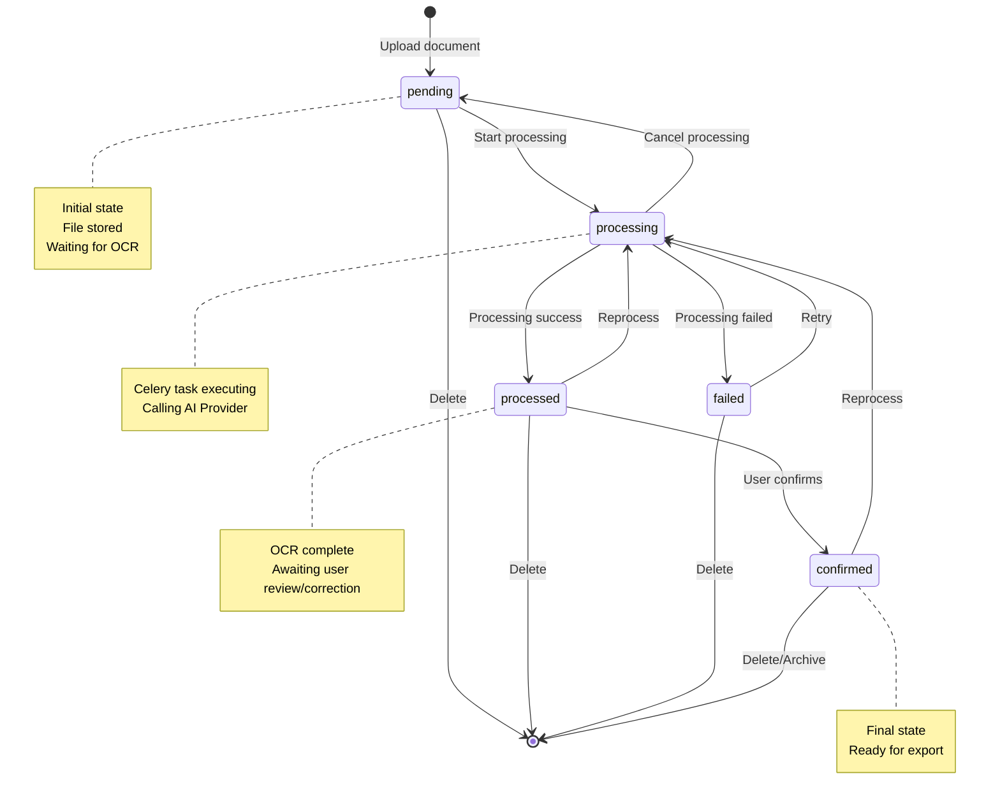
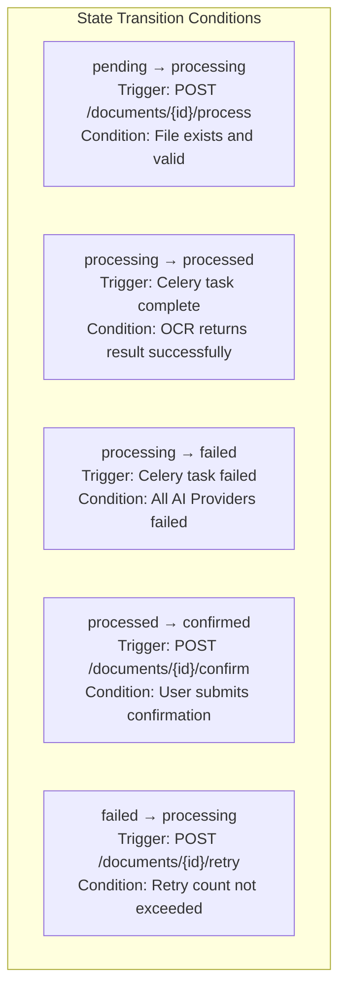
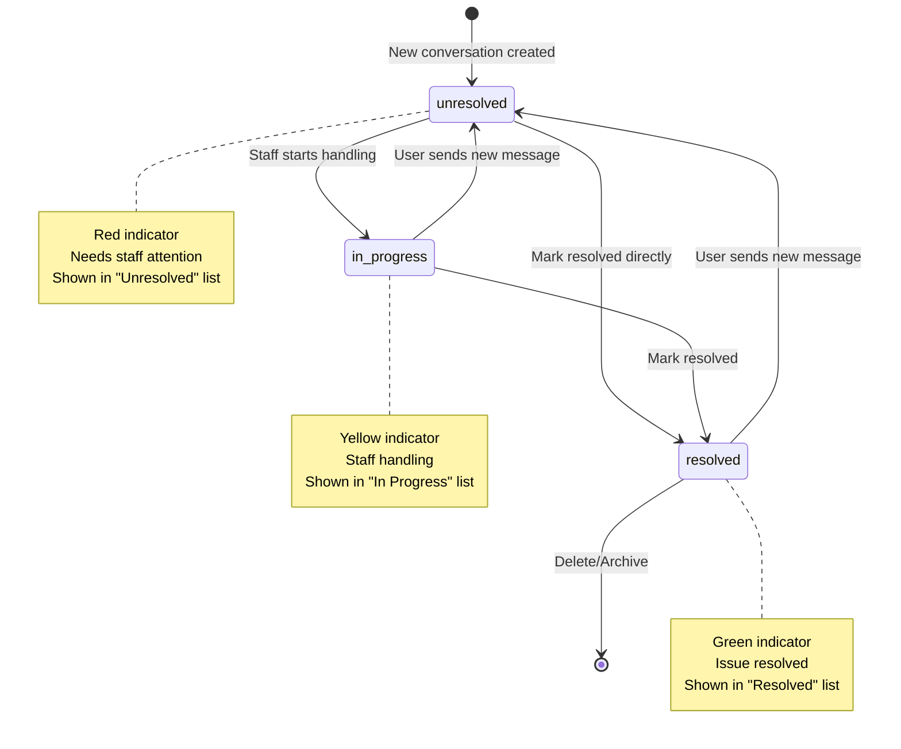
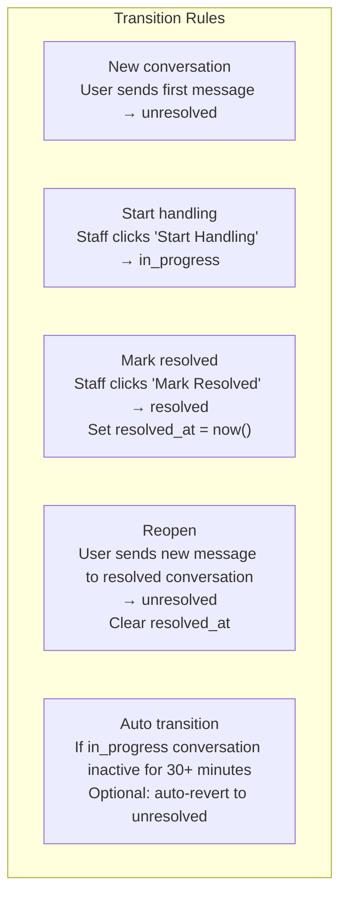
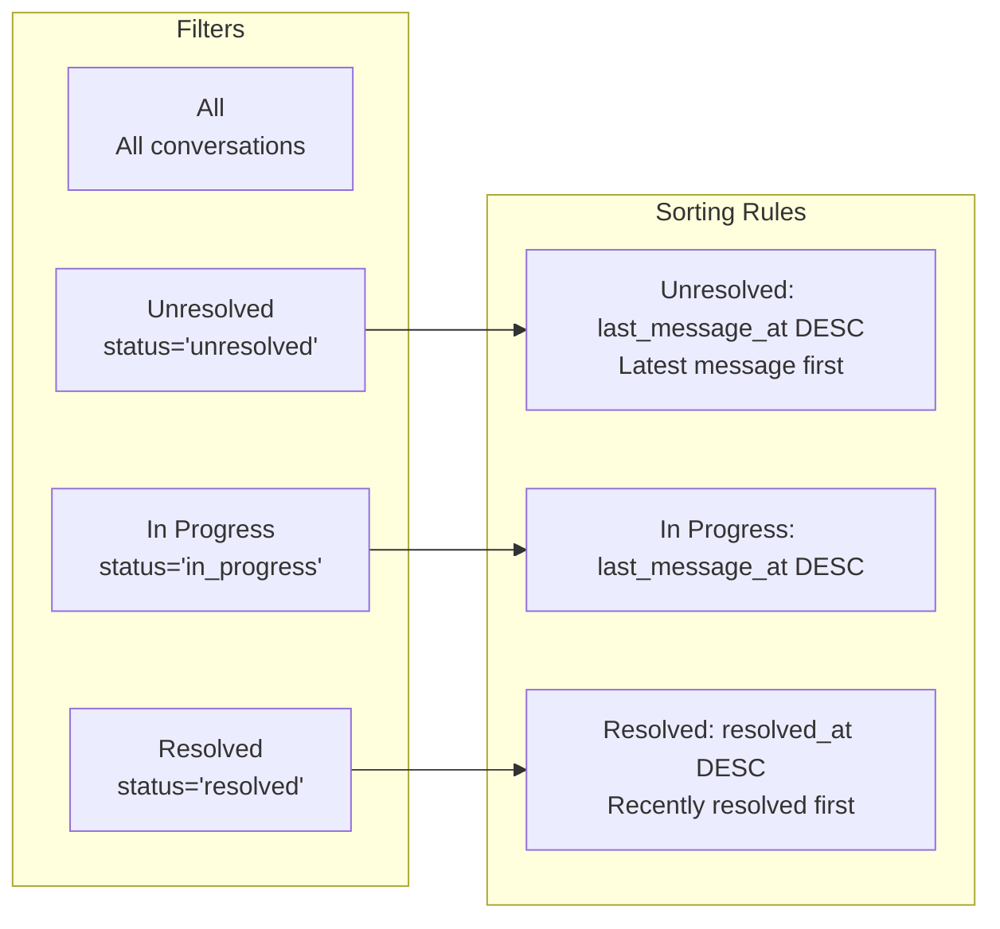
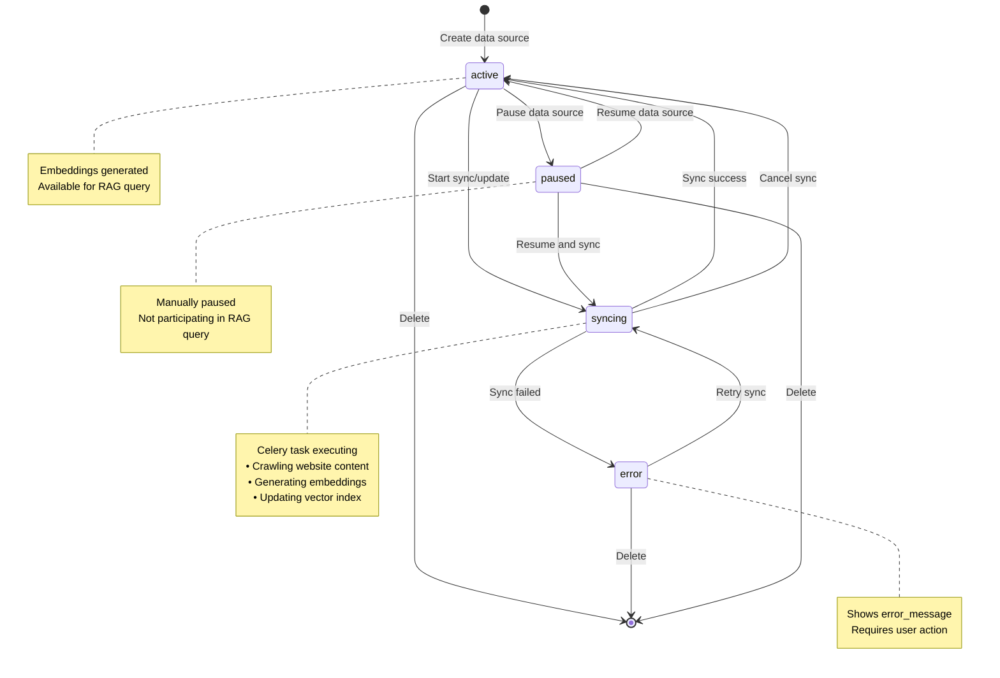
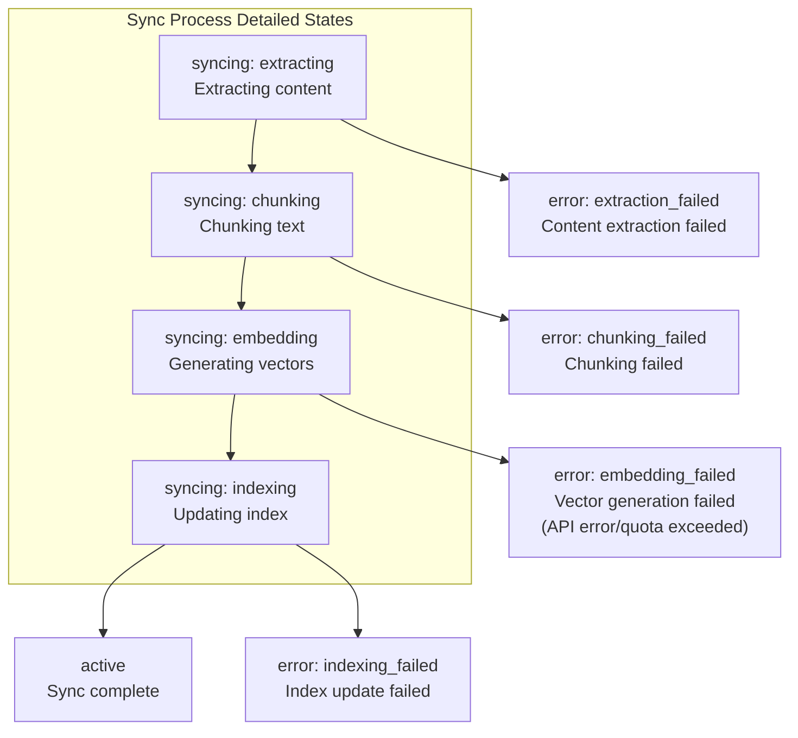

# State Diagrams

## Overview
Shows state transitions for three main entities in the system: Document, AssistantConversation, and DataSource.

---

## 1. Document State Diagram

### State Definitions

| State | Description | Available Actions |
|-------|-------------|-------------------|
| `pending` | Uploaded, waiting for processing | Start processing, Delete |
| `processing` | OCR processing in progress | Cancel processing |
| `processed` | Processing complete, pending confirmation | Confirm, Reprocess, Delete |
| `failed` | Processing failed | Retry, Delete |
| `confirmed` | User confirmed | Export, Delete, Reprocess |

### State Transition Diagram

### Detailed Transition Conditions

---

## 2. AssistantConversation State Diagram

### State Definitions

| State | Description | Trigger Condition |
|-------|-------------|-------------------|
| `unresolved` | Unresolved, needs attention | New conversation, resolved conversation receives new message |
| `in_progress` | In progress | Staff starts handling |
| `resolved` | Resolved | Staff marks complete |

### State Transition Diagram

### Detailed Transition Rules

### Inbox Display Logic

---

## 3. DataSource State Diagram

### State Definitions

| State | Description | Available Actions |
|-------|-------------|-------------------|
| `active` | Normal, queryable | Sync, Delete |
| `syncing` | Syncing/Updating | Cancel sync |
| `error` | Sync failed | Retry, Delete |
| `paused` | Paused | Resume, Delete |

### State Transition Diagram

### Sync Process States

---

## 4. Combined State Relationship Diagram

```mermaid
flowchart TB
    subgraph DocStates["📄 Document States"]
        D_pending["pending"]
        D_processing["processing"]
        D_processed["processed"]
        D_failed["failed"]
        D_confirmed["confirmed"]
    end

    subgraph ConvStates["💬 Conversation States"]
        C_unresolved["unresolved"]
        C_in_progress["in_progress"]
        C_resolved["resolved"]
    end

    subgraph DSStates["📂 DataSource States"]
        DS_active["active"]
        DS_syncing["syncing"]
        DS_error["error"]
        DS_paused["paused"]
    end

    %% Document Flow
    D_pending --> D_processing
    D_processing --> D_processed
    D_processing --> D_failed
    D_processed --> D_confirmed

    %% Conversation Flow
    C_unresolved --> C_in_progress
    C_in_progress --> C_resolved
    C_resolved -.-> C_unresolved

    %% DataSource Flow
    DS_active --> DS_syncing
    DS_syncing --> DS_active
    DS_syncing --> DS_error
    DS_error --> DS_syncing

    style D_pending fill:#fff3e0
    style D_processing fill:#e3f2fd
    style D_processed fill:#e8f5e9
    style D_failed fill:#ffebee
    style D_confirmed fill:#c8e6c9

    style C_unresolved fill:#ffebee
    style C_in_progress fill:#fff3e0
    style C_resolved fill:#c8e6c9

    style DS_active fill:#c8e6c9
    style DS_syncing fill:#e3f2fd
    style DS_error fill:#ffebee
    style DS_paused fill:#f5f5f5
```

---

## State Color Specification

| State Type | Color | HEX | Meaning |
|------------|-------|-----|---------|
| Waiting/Initial | Orange | `#fff3e0` | Action required |
| Processing | Blue | `#e3f2fd` | System processing |
| Success/Complete | Green | `#c8e6c9` | Normal state |
| Error/Failed | Red | `#ffebee` | Needs attention |
| Paused/Disabled | Gray | `#f5f5f5` | Inactive |
