# Deployment Diagram

## Overview
Shows Doctify's Docker containerized deployment architecture, including development and production environment configurations.

---

## Development Environment Deployment Architecture

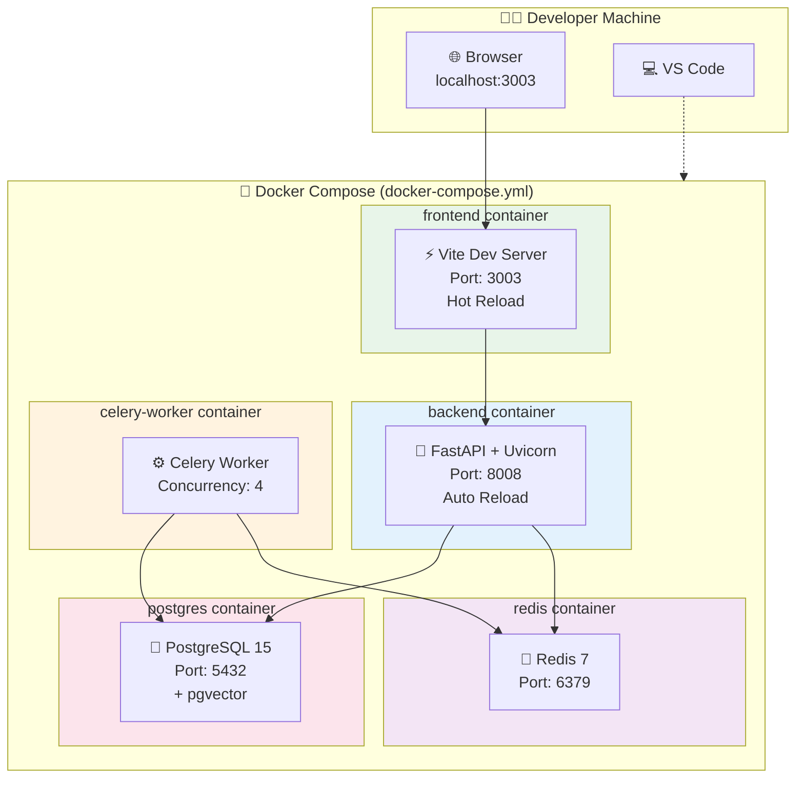

### Development Environment Port Mapping

| Service | Container Port | Host Port | Description |
|---------|----------------|-----------|-------------|
| Frontend | 3003 | 3003 | Vite dev server |
| Backend | 8008 | 8008 | FastAPI service |
| PostgreSQL | 5432 | 5432 | Database |
| Redis | 6379 | 6379 | Cache/Queue |

---

## Production Environment Deployment Architecture

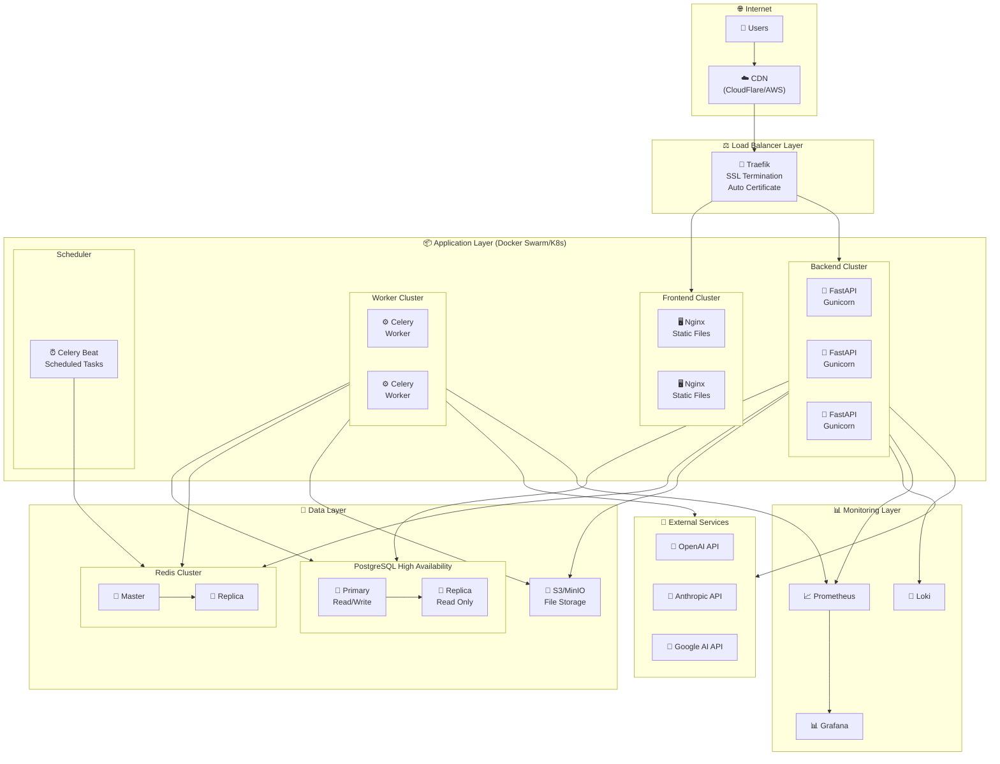

---

## Docker Compose Configuration Overview

### Development Environment (docker-compose.yml)

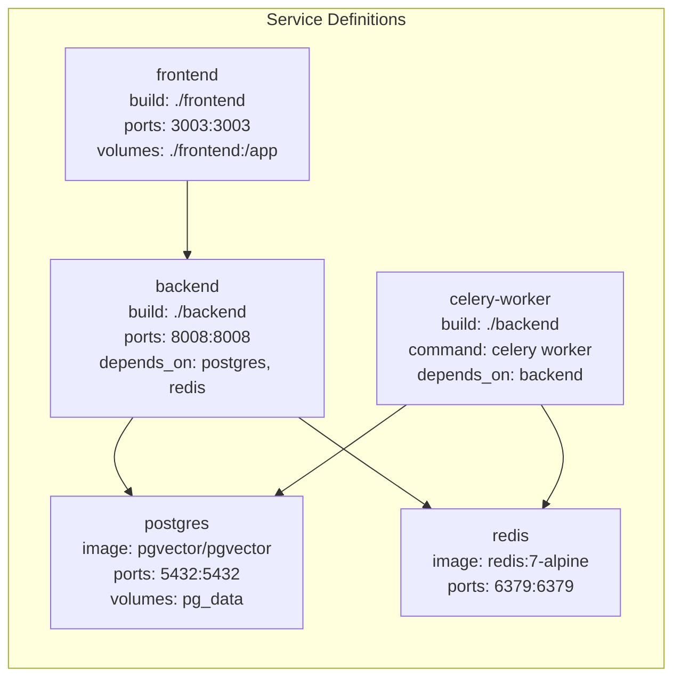

### Production Environment (docker-compose.prod.yml)

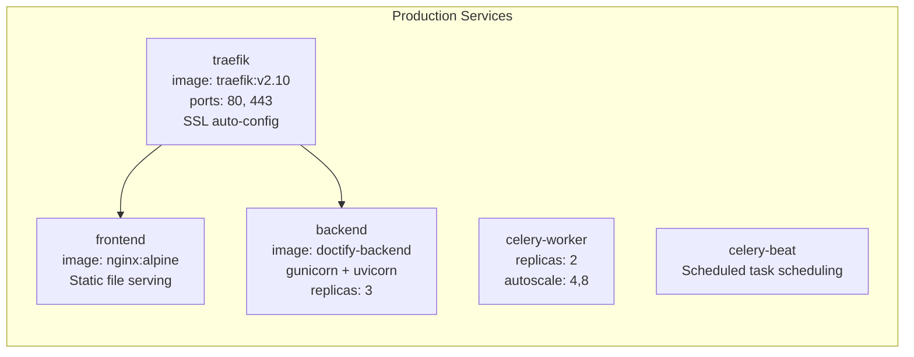

---

## Network Architecture

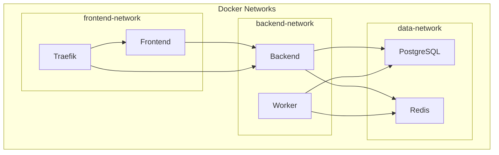

---

## Container Resource Configuration

### Development Environment

| Service | CPU | Memory | Notes |
|---------|-----|--------|-------|
| frontend | - | - | No limits |
| backend | - | - | No limits |
| celery-worker | - | - | No limits |
| postgres | - | - | No limits |
| redis | - | - | No limits |

### Production Environment

| Service | CPU (limit) | Memory (limit) | Replicas |
|---------|-------------|----------------|----------|
| frontend | 0.5 | 256MB | 2 |
| backend | 2.0 | 2GB | 3 |
| celery-worker | 1.0 | 1GB | 2-4 (autoscale) |
| celery-beat | 0.25 | 256MB | 1 |
| postgres | 4.0 | 8GB | 1 primary + 1 replica |
| redis | 1.0 | 1GB | 1 master + 1 replica |

---

## Data Persistence

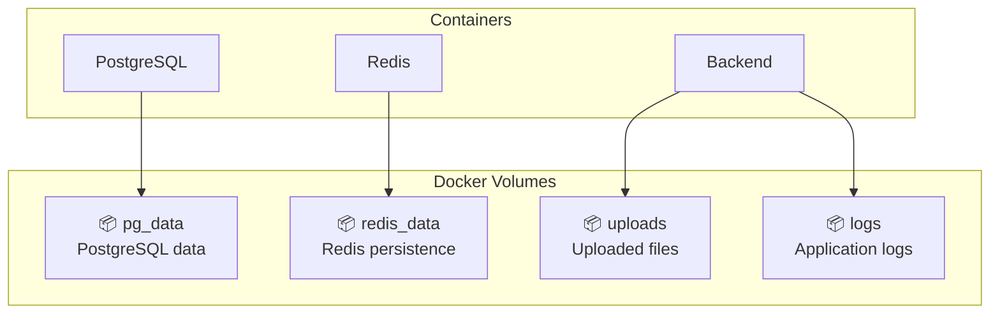

### Production Environment Storage

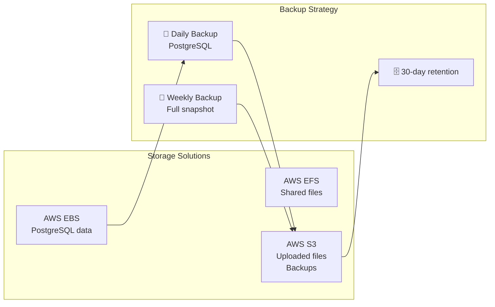

---

## CI/CD Deployment Flow

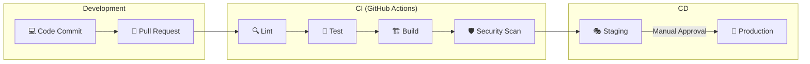

---

## Health Check Configuration

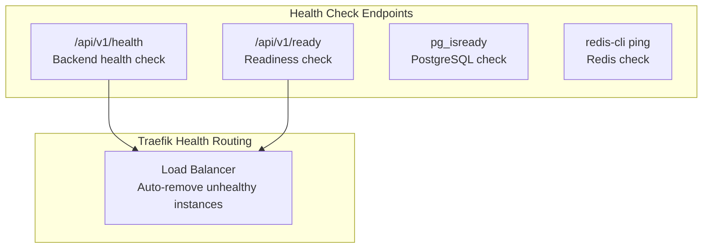

### Health Check Configuration Example

```yaml
healthcheck:
  test: ["CMD", "curl", "-f", "http://localhost:8008/api/v1/health"]
  interval: 30s
  timeout: 10s
  retries: 3
  start_period: 40s
```

---

## Environment Variable Management

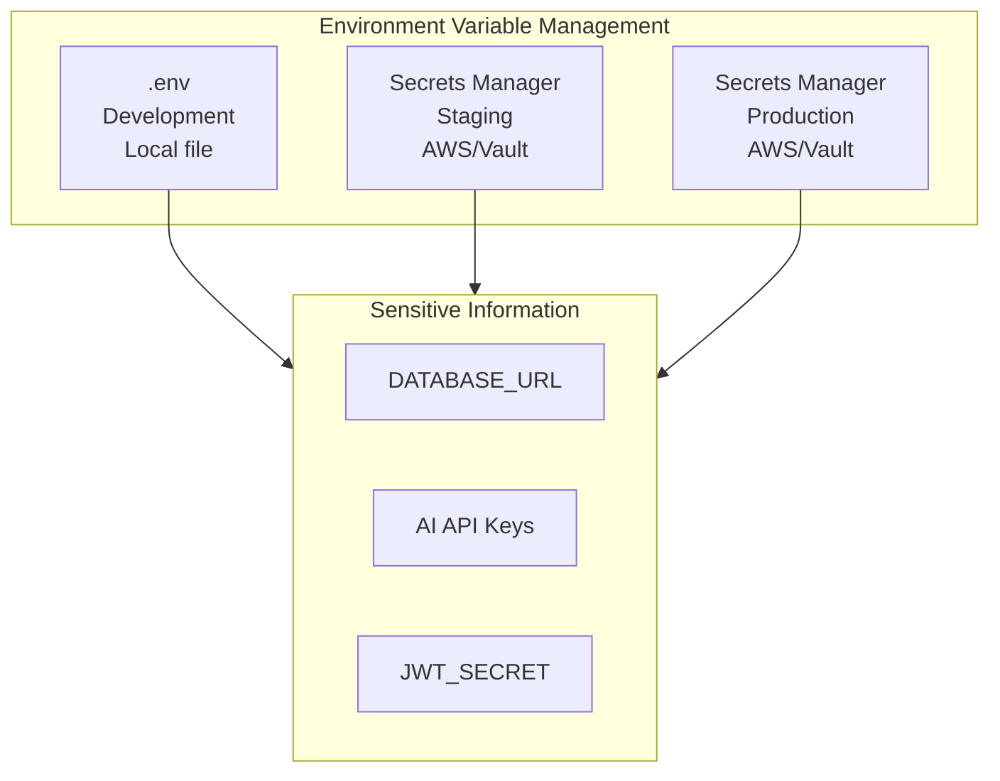

---

## Monitoring and Alerting Architecture

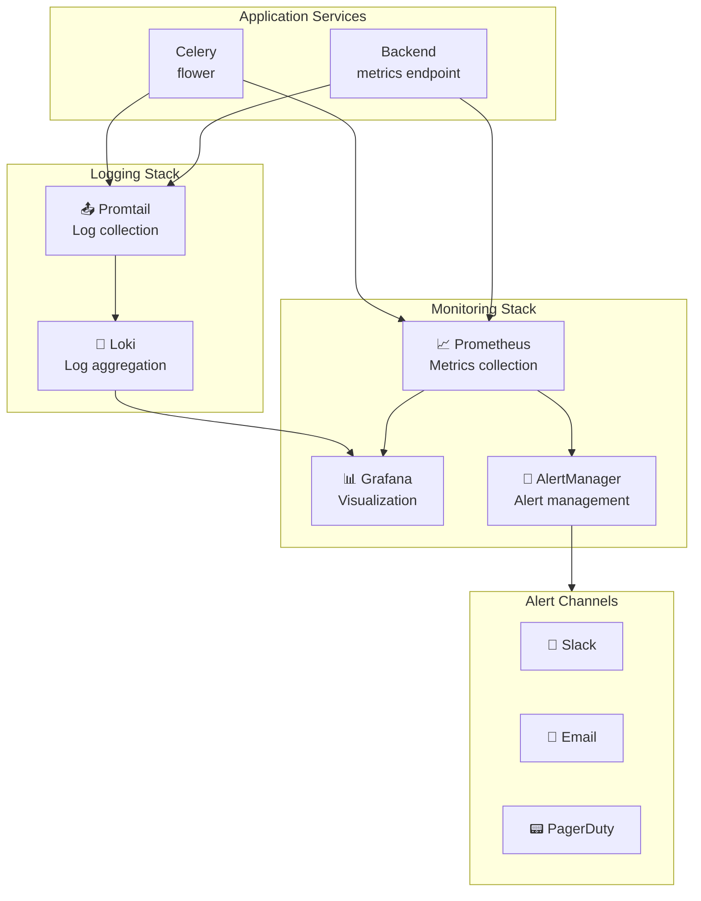
