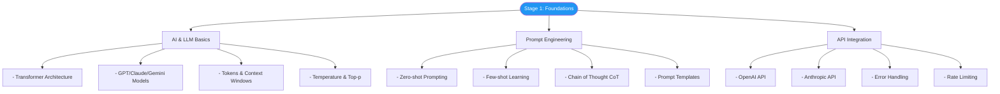
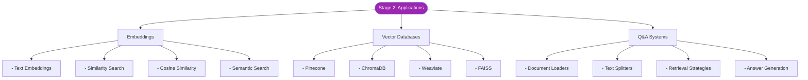
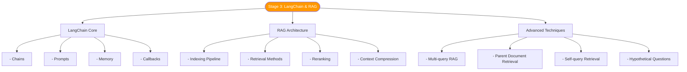
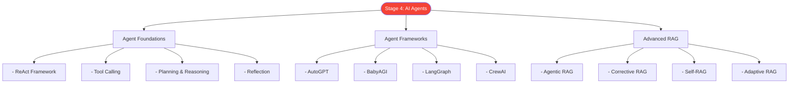
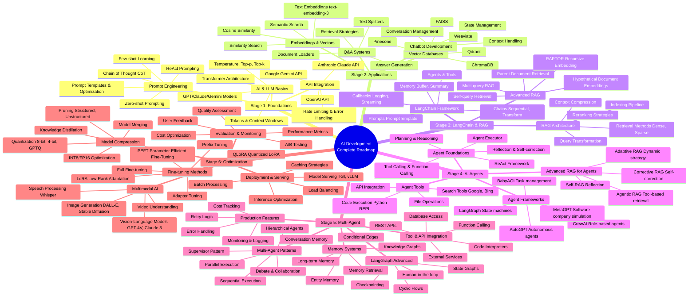

# AI Development Learning Roadmap

## Overview

This document provides a comprehensive learning roadmap for AI development, from foundational concepts to expert-level optimization techniques. The roadmap is designed to be accessible to learners with a high school education level and covers the complete AI development stack.

## Complete Learning Path

### Stage 1: Foundations (3-6 months)

Foundation stage covering AI basics, prompt engineering, and API integration.

**Key Learning Outcomes**:
- Understanding of transformer architecture and how LLMs work
- Ability to craft effective prompts for various tasks
- Knowledge of API integration and best practices
- Understanding of model parameters (temperature, top-p, tokens)

**Recommended Projects**:
1. Build a simple chatbot using OpenAI API
2. Create a prompt template library
3. Implement API error handling and retry logic

---

### Stage 2: Application Development (3-6 months)

Learn to build production-ready AI applications with embeddings and vector databases.

**Key Learning Outcomes**:
- Understanding of embeddings and vector representations
- Ability to work with vector databases
- Knowledge of semantic search techniques
- Skills in building Q&A systems

**Recommended Projects**:
1. Build a document Q&A system
2. Create a semantic search engine
3. Implement a chatbot with memory

---

### Stage 3: LangChain & RAG (3-6 months)

Master LangChain framework and Retrieval-Augmented Generation (RAG) architecture.

**Key Learning Outcomes**:
- Proficiency in LangChain framework
- Understanding of RAG architecture and patterns
- Knowledge of advanced retrieval techniques
- Ability to optimize RAG systems

**Recommended Projects**:
1. Build a production RAG system
2. Implement multi-query RAG
3. Create a document chat application

---

### Stage 4: AI Agents (4-8 months)

Learn to build autonomous AI agents with reasoning and tool-use capabilities.

**Key Learning Outcomes**:
- Understanding of agent architectures
- Ability to implement ReAct and tool-calling
- Knowledge of various agent frameworks
- Skills in building agentic RAG systems

**Recommended Projects**:
1. Build a research agent
2. Create a coding assistant agent
3. Implement multi-tool agent system

---

### Stage 5: Multi-Agent Systems (4-8 months)

Master complex multi-agent architectures with LangGraph and production features.

```mermaid
graph TB
    Start([Stage 5: Multi-Agent]) --> S5_1[LangGraph Advanced]
    S5_1 --> S5_1a[- State Graphs]
    S5_1 --> S5_1b[- Conditional Edges]
    S5_1 --> S5_1c[- Cyclic Flows]
    S5_1 --> S5_1d[- Human-in-the-loop]

    Start --> S5_2[Memory Systems]
    S5_2 --> S5_2a[- Conversation Memory]
    S5_2 --> S5_2b[- Entity Memory]
    S5_2 --> S5_2c[- Knowledge Graphs]
    S5_2 --> S5_2d[- Long-term Memory]

    Start --> S5_3[Multi-Agent Patterns]
    S5_3 --> S5_3a[- Hierarchical Agents]
    S5_3 --> S5_3b[- Sequential Execution]
    S5_3 --> S5_3c[- Parallel Execution]
    S5_3 --> S5_3d[- Supervisor Pattern]

    Start --> S5_4[Tool Integration]
    S5_4 --> S5_4a[- Function Calling]
    S5_4 --> S5_4b[- API Integration]
    S5_4 --> S5_4c[- Code Execution]
    S5_4 --> S5_4d[- External Tools]

    style Start fill:#E91E63,color:#fff
```

**Key Learning Outcomes**:
- Mastery of LangGraph for complex workflows
- Understanding of memory systems and persistence
- Ability to coordinate multiple agents
- Skills in production-ready tool integration

**Recommended Projects**:
1. Build a multi-agent software development team
2. Create a hierarchical agent system
3. Implement agent collaboration patterns

---

### Stage 6: Model Optimization (4-8 months)

Learn advanced techniques for fine-tuning, compression, and production deployment.

```mermaid
graph TB
    Start([Stage 6: Optimization]) --> S6_1[Fine-tuning Methods]
    S6_1 --> S6_1a[- Full Fine-tuning]
    S6_1 --> S6_1b[- LoRA Low-Rank Adaptation]
    S6_1 --> S6_1c[- QLoRA Quantized LoRA]
    S6_1 --> S6_1d[- Prefix Tuning]

    Start --> S6_2[Model Compression]
    S6_2 --> S6_2a[- Quantization 8-bit, 4-bit]
    S6_2 --> S6_2b[- Pruning]
    S6_2 --> S6_2c[- Knowledge Distillation]
    S6_2 --> S6_2d[- Model Merging]

    Start --> S6_3[Production Deployment]
    S6_3 --> S6_3a[- Model Serving]
    S6_3 --> S6_3b[- Inference Optimization]
    S6_3 --> S6_3c[- Monitoring & Logging]
    S6_3 --> S6_3d[- Cost Optimization]

    Start --> S6_4[Multimodal AI]
    S6_4 --> S6_4a[- Vision-Language Models]
    S6_4 --> S6_4b[- Speech Processing]
    S6_4 --> S6_4c[- Image Generation]
    S6_4 --> S6_4d[- Video Understanding]

    style Start fill:#00BCD4,color:#fff
```

**Key Learning Outcomes**:
- Expertise in fine-tuning techniques
- Understanding of model compression methods
- Knowledge of production deployment strategies
- Skills in multimodal AI development

**Recommended Projects**:
1. Fine-tune a model for specific domain
2. Optimize model inference for production
3. Build a multimodal application

---

## Complete Roadmap Mindmap

This comprehensive mindmap shows all stages and their interconnections:

---

## Simplified Linear Path

For quick reference, here's the simplified learning path:

---

## Learning Resources

### Stage 1-2 Resources
- **Courses**: DeepLearning.AI - ChatGPT Prompt Engineering
- **Books**: "Build a Large Language Model (From Scratch)" by Sebastian Raschka
- **Documentation**: OpenAI API Docs, Anthropic Claude Docs

### Stage 3-4 Resources
- **Courses**: LangChain Academy, DeepLearning.AI - LangChain
- **Documentation**: LangChain Docs, Pinecone Docs
- **Projects**: Build RAG systems, implement agent frameworks

### Stage 5-6 Resources
- **Courses**: HuggingFace Fine-tuning Course
- **Papers**: LangGraph papers, Multi-agent research
- **Tools**: vLLM, Text Generation Inference (TGI)

---

## Estimated Timeline

| Stage | Duration | Difficulty | Prerequisites |
|-------|----------|------------|---------------|
| Stage 1 | 3-6 months | Beginner | Basic programming |
| Stage 2 | 3-6 months | Intermediate | Stage 1 + Python |
| Stage 3 | 3-6 months | Intermediate | Stage 2 + API experience |
| Stage 4 | 4-8 months | Advanced | Stage 3 + System design |
| Stage 5 | 4-8 months | Advanced | Stage 4 + Production experience |
| Stage 6 | 4-8 months | Expert | Stage 5 + ML fundamentals |

**Total Time**: 2-4 years to expert level (depending on learning pace and prior experience)

---

## Success Metrics

### Stage 1-2
- ✅ Can build functional chatbots
- ✅ Understand embedding similarity
- ✅ Implement basic RAG systems

### Stage 3-4
- ✅ Build production RAG applications
- ✅ Create functional AI agents
- ✅ Use multiple agent frameworks

### Stage 5-6
- ✅ Design multi-agent systems
- ✅ Fine-tune models successfully
- ✅ Deploy production AI systems

---

*Created: 2026-02-04*
*Tools: Claude Code + Mermaid*
*Version: 1.0*
